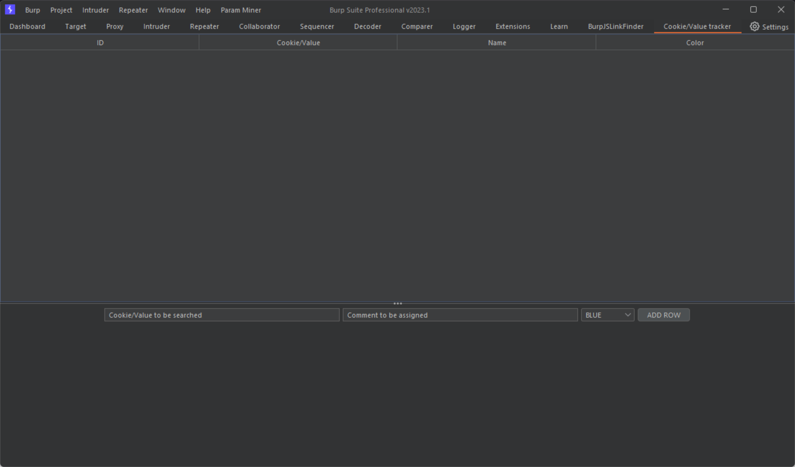
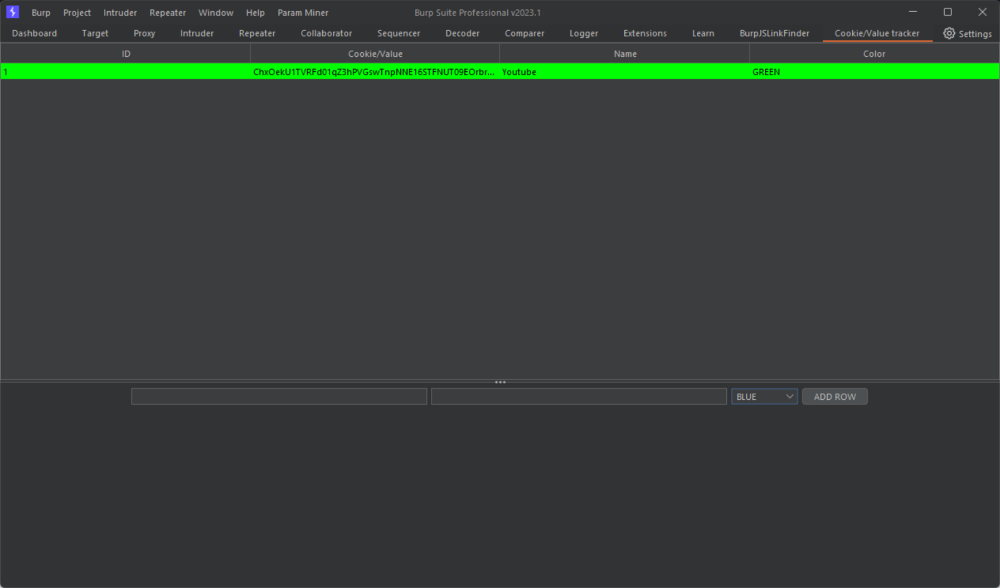
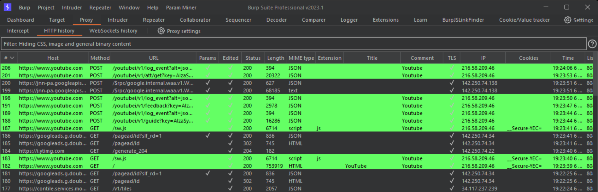

# Cookie/Value tracker
Burp extension used to track cookies or values in HTTP History while performing Penetration Testing activities.
The extension uses [Montoya API](https://github.com/PortSwigger/burp-extensions-montoya-api), available since version 2023.1 of Burp Suite application.

## Installation
Generate JAR file and include it in Burp Extensions tab.

## How to use it
The extension creates a new Tab, where the user can insert cookie/value to be tracked. 
Moreover the user specifies the color and the comment to be used in requests that use cookie/value.

## Example
1. Insert cookie, comment and color in extension tab

2. Add row to tracking table

3. Perform PT activities with extension working on background
