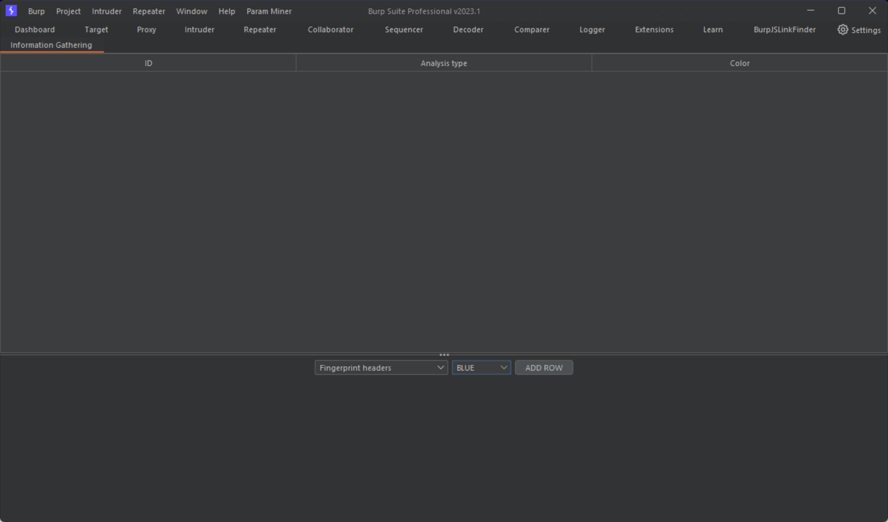
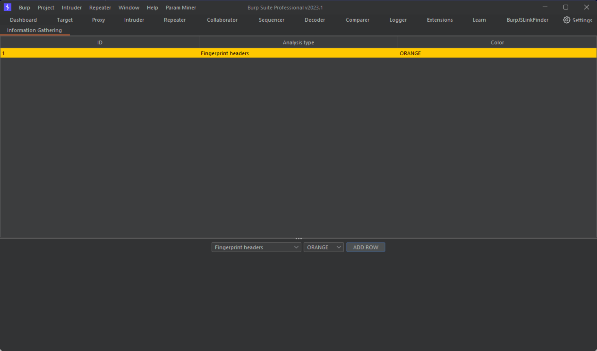
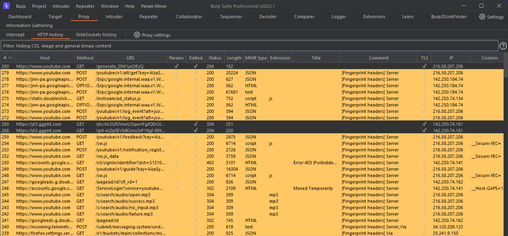

# Information Gathering Live
Burp extension used to highlight the presence of some HTTP headers in History responses.
The extension uses [Montoya API](https://github.com/PortSwigger/burp-extensions-montoya-api), available since version 2023.1 of Burp Suite application.

## Installation
Generate JAR file and include it in Burp Extensions tab.

## How to use it
The extension creates a new Tab, where the user can select which analysis they want to perform. 
Moreover the user specifies the color for HTTP responses with issues.

## Example
1. Insert analysis type and related color

2. Add row to analysis table

3. Perform PT activities with extension working on background
