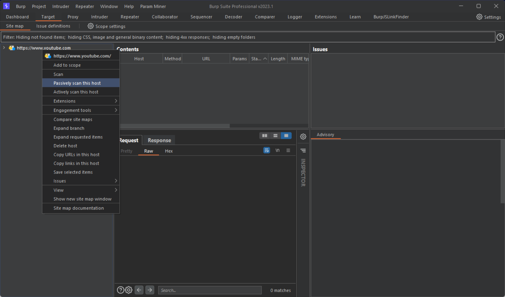
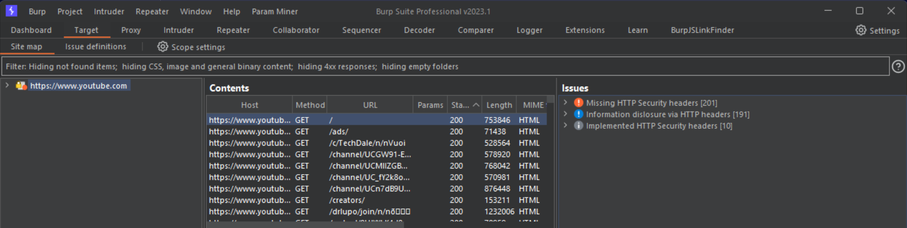

# Information Gathering Passive
Burp extension used to identify the presence of some HTTP headers in History and Site responses through passive scan.
The extension uses [Montoya API](https://github.com/PortSwigger/burp-extensions-montoya-api), available since version 2023.1 of Burp Suite application.

## Installation
Generate JAR file and include it in Burp Extensions tab.

## How to use it
The extension creates issues about HTTP headers by analysing History and Site responses using a passive scan.

## Example
1. Perform passive scan on host (or make any request you want)

2. Check issues generated by the extension
